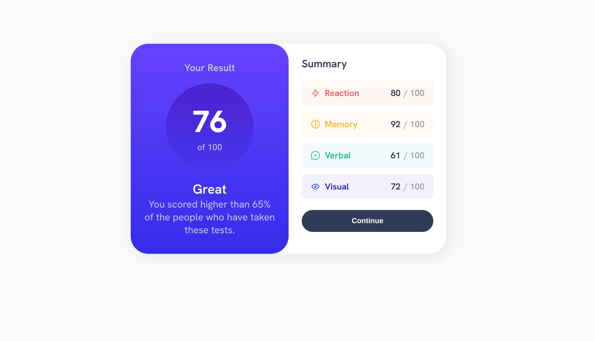

# Frontend Mentor - Results summary component solution

This is a solution to the [Results summary component challenge on Frontend Mentor](https://www.frontendmentor.io/challenges/results-summary-component-CE_K6s0maV). Frontend Mentor challenges help you improve your coding skills by building realistic projects. 

### Screenshot

### Links

- Solution URL: [Solution](https://github.com/Praiseson6065/frontendmentor_1)
- Live Site URL: [Site](https://praiseson6065.github.io/frontendmentor_1/)

## My process

### Built with

- Semantic HTML5 markup
- CSS custom properties
- Flexbox

## Author

- Frontend Mentor - [Praiseson6065](https://www.frontendmentor.io/profile/Praiseson6065)
- Linkedin - [Praiseson Yanamadala](https://www.linkedin.com/in/praiseson-yanamadala-606613220/)

